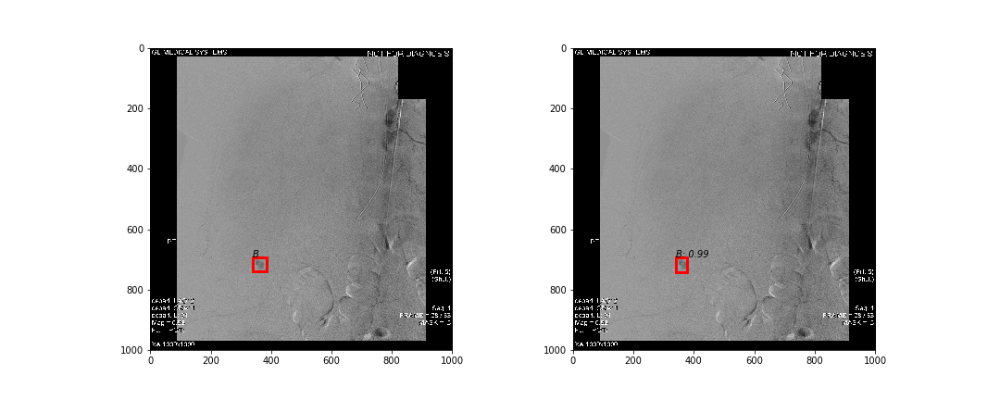

# Faster RCNN Analysis Codes

The notebook [IoU.ipynb](IoU.ipynb) provides the code to test and generate the top 1 results from Faster R-CNN model for the voting module. It will output both testing results and a txt file to summarize all the bboxes.

The demo detected images are shown below

