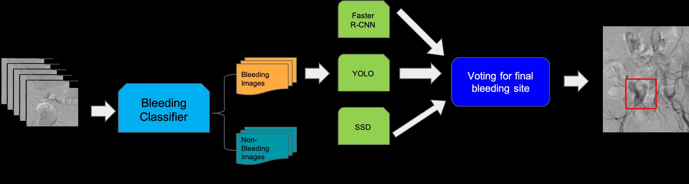

# CS766Projects_Medical_Image_Analysis
CS766  Projects Medical Image Analysis

Yiqin Pan, Zhiyi Chen, Mingren Shen

[Project Website](https://sites.google.com/wisc.edu/cs766-spring2019-bleedingsite/home)

## Models

We provide codes we use for three different models we used for this projects.

| Models        |      Framework     |       Weights           | 
| ---------------- |:-------------------------------------------------------------------:|:-------------------------------------------------------------:| 
| Faster R-CNN   |   [ChainerCV](https://github.com/chainer/chainercv/tree/master/examples/faster_rcnn)   | [Weights](https://drive.google.com/a/wisc.edu/file/d/1nLUmV_aFQP74gn6lGTJ2byojG5rD7OIx/view?usp=sharing)   |
| SSD   | [Keras + TensorFlow](https://github.com/qqwweee/keras-yolo3)    | [Weights](https://drive.google.com/a/wisc.edu/file/d/1TqsYJCWyrOGUtnqnIf82UWdeagtz--v6/view?usp=sharing)    | 
| YOLO | [Keras + TensorFlow](https://github.com/pierluigiferrari/ssd_keras)        | [Weights](https://drive.google.com/a/wisc.edu/file/d/12bYVJbjeX6We94H_1AvbDyMmojDApDLa/view?usp=sharing)     | 

We also provide a submitting scripts to train those models on Euler of UW-Madison. All 3 models are trained with GTX 1080 GPU. Please follow the specific instructions listed there.

Due to data privacy concenrn, data is provided only for Prof.Mohit Gupta and TA.

## Project Proposal

#### Motivation

Arteriograms are the X-ray images for arteries in the heart, brain and other parts of the body by injecting a special dye into the arteries to enhance the blood vessel. And in real-world practice, radiologists are required to identify the bleeding sites in the image to provide information for future medical intervention. However, analyzing those image results requires manual inspection and discussion of experience radiologists which is slow, labor-intensive and error-prone. So we want to use deep learning based object detection methods to help identify those bleeding sites. 

#### Our approach

The reason we are developing our own approach is that the dataset we are using, the Active Extravasation on Arteriograms image datasets, may change significantly according to different patient situations which impedes the performance of common object detection algorithms e.g. Faster R-CNN, YOLO. 

So we plan to borrow the idea of [ensemble learning](https://en.wikipedia.org/wiki/Ensemble_learning) and try to using crowd voting to get a better performance of the model. If we can combine different algorithms together, theoretically we can get better results.

## Results

### Project Presentation

We provide our final project presenation in our project website, [Project Presenation](https://sites.google.com/wisc.edu/cs766-spring2019-bleedingsite/home/final-presentation)